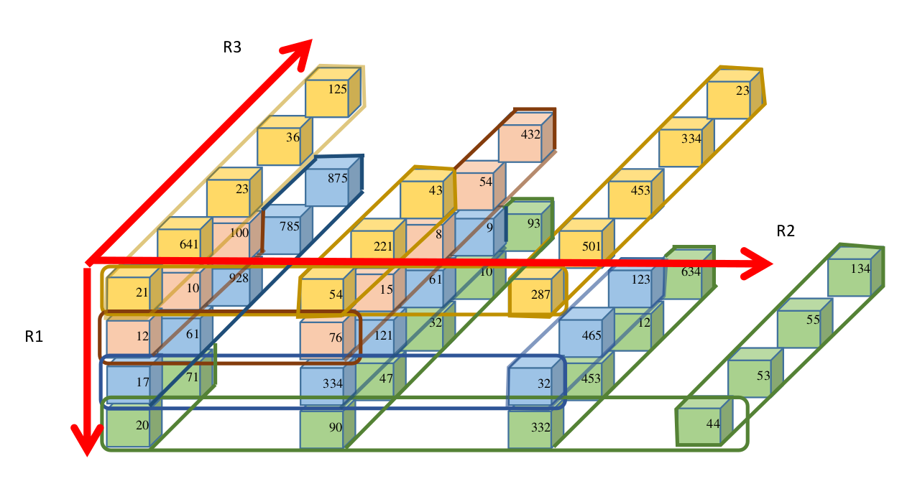
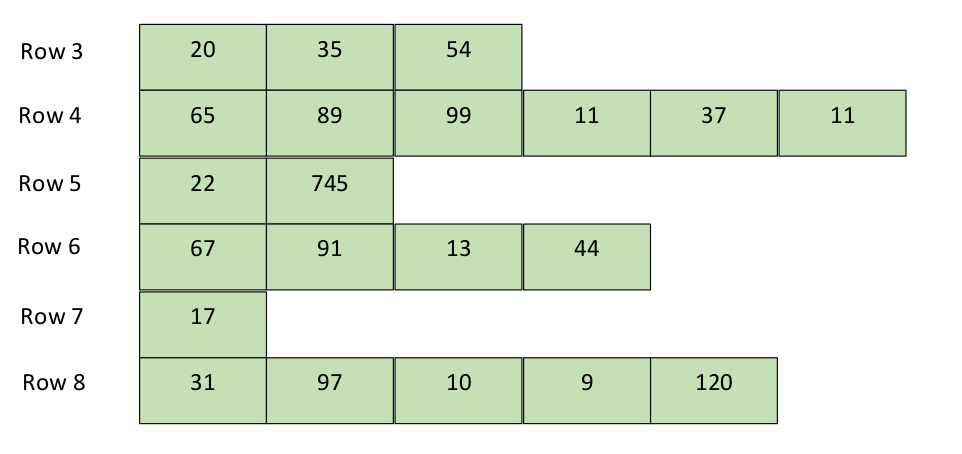

# JagScript

**C-Like Language/Compiler with Native Support for Jagged Arrays**

## Salient Features of Language

- Native Support for Jagged Arrays
- Support for Array Arithmetic
- Boolean primitives

## Jagged Arrays

Jaged Arrays in JagScript are divided into 2 types:

- ### 3D Jagged Arrays

- ### 2D Jagged Arrays

## Interacting with the Compiler

**Option 0:** exit
**Option 1:** Create parse tree
**Option 2:** Traverse the parse tree to construct typeExpressionTable. Also print the type errors while
traversing the parse tree and accessing the typeExpressionTable.
**Option 3:** Print parse tree in the specified format
**Option 4:** Print typeExpressionTable in the specified format

## Authors

- [Ashrya Agrawal](https://github.com/ashryaagr)
- [Kalit Naresh Inani](https://github.com/Kalit31)
- [Prajwal](https://github.com/pajlik)
